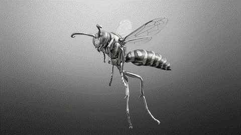

<table>
<tr>
<td valign="top" width="68%">

```text
$ jamal --status
├── studying      CSIT, AI and Data Science @ E-JUST
├── building      pipelines, automations, and systems that run without me
├── learning      lakehouse patterns, orchestration, dbt modeling
├── freelancing   n8n automations, scraping, data cleaning
├── designing     Miyabi Jamal Studio, wabi-sabi minimalism
└── open to       data roles, freelance gigs, hackathon teams
```

Giza, Egypt. I build data pipelines and automate the boring parts.

</td>
<td valign="middle" align="center" width="40%">



</td>
</tr>
</table>


```text
$ jamal --now
├── shipping      a MENA data pipeline: scrape > clean > decide
├── competing     NASA Space Apps with EARTH//NEXT, a planetary risk simulator
├── next up       Meta's Muse Spark hackathon with Rosetta
├── designing     brand and layout work at Miyabi Jamal Studio
└── finishing     the degree at E-JUST
```


```text
$ jamal --stack
├── data          PySpark · Databricks · Azure ADF · Airflow · dbt
├── automation    n8n · scraping · APIs
├── ai            LLMs · ML models
├── embedded      microcontrollers and hardware project
├── design        brand, layout, wabi-sabi minimalism
└── languages     Python · SQL
```


<p align="center">
  
  
</p>


```text
$ jamal --contact
├── linkedin     linkedin.com/in/jamal-el-shenawy/
└── mail         jamalcsit05@gmail.com
```


